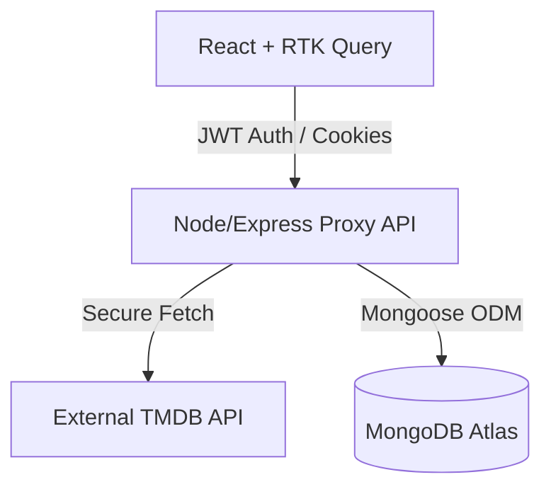

<div align="center">
  
  
  
  
  <br/>
  
  # 🎬 CinmeaHUb
  
  **A Premium, Production-Grade Full-Stack Movie Discovery Platform**
  
  <p>
    
    
    
    
    
    
  </p>
  
  CinemaHUB is a complete MERN stack application built for performance, security, and a cinematic user experience. It seamlessly integrates the TMDB API through a secure Node.js proxy and offers advanced features like individual watch histories, favorites, and a fully functional Admin Dashboard.
</div>

<br/>

---

## ✨ Key Features

### 🍿 For Users
- **Cinematic UI/UX:** Dark-mode optimized, premium aesthetic using soft gradients, backdrop-blur components, and Framer Motion micro-interactions.
- **Infinite Scrolling & Debounced Search:** Fluid movie discovery seamlessly powered by Intersection Observers and optimized, throttled API queries.
- **Persistent Data & Syncing:** User's Watch History and Favorites are safely stored in MongoDB and instantly synced across all devices.
- **Secure Authentication:** Implementing industry-standard short-lived Access Tokens and long-lived HTTP-Only Refresh Tokens for rock-solid security.
- **Actors & Filmography:** Deep dive into actor pages, read bios, and discover their comprehensive movie/TV appearances.
- **Movie Trailers & Dynamic Popups:** Instant-load full-screen trailer modals masking YouTube embeds.

### 🛡️ For Administrators
- **Custom Admin Interface:** A dedicated `/admin` control center to oversee platform metrics.
- **Movie Database Editor:** Full CRUD operations to manually add, edit, or purge movies outside of TMDB.
- **User Management Portal:** Ability to oversee registered users, enforce bans, or completely wipe identities.

---

## 🛠️ Technology Stack

### Frontend (Client)
- **Framework:** React 19 (Vite 7)
- **Routing:** React Router v7
- **State Management:** Redux Toolkit & RTK Query (Advanced API side-effects and caching)
- **Styling:** Tailwind CSS v4 & custom CSS variables for design system consistency
- **Animations:** Framer Motion & Swiper.js

### Backend (Server)
- **Runtime Environment:** Node.js >v20.x
- **Framework:** Express.js 4.x
- **Database Wrapper:** Mongoose 8.x (MongoDB Atlas)
- **Authentication:** jsonwebtoken, bcryptjs, cookie-parser
- **API Security:** Helmet, express-rate-limit, cors
- **Logging:** Morgan

---

## 📁 System Architecture

To prevent API Keys from leaking (a critical vulnerability in many TMDB consumer apps), **the client never interacts with TMDB directly**. 

All requests are strictly proxied through the Express.js Backend where our hidden `TMDB_API_KEY` is securely injected. The backend handles data transformation and caching prior to returning strict payloads to the client UI.



---

## 🚀 Quick Start (Local Deployment)

### 1. Clone & Install Dependencies
First, clone the repository and install both client and server packages in a split terminal.

```bash
# Install Backend Dependencies
cd server
npm install

# Install Frontend Dependencies
cd ../client
npm install
```

### 2. Configure Environment Variables
Create `.env` files based on the provided `.env.example` records.

**Server (`server/.env`):**
```env
PORT=5000
MONGO_URI=mongodb+srv://<user>:<password>@cluster.mongodb.net/CinemaHUB
JWT_SECRET=your_ultra_secure_jwt_string
JWT_REFRESH_SECRET=your_ultra_secure_jwt_refresh_string
TMDB_API_KEY=your_private_tmdb_v3_api_key
CLIENT_URL=http://localhost:5173
NODE_ENV=development
```

**Client (`client/.env`):**
```env
VITE_API_URL=http://localhost:5000/api
```

### 3. Spin up the Development Environment
```bash
# Terminal 1 - Boot the Express API
cd server
npm run dev

# Terminal 2 - Boot the Vite Client
cd client
npm run dev
```

Navigate to [http://localhost:5173](http://localhost:5173) to view the application!

---

## 📡 Core API Routes

A brief overview of the internally consumed REST API layer:

### Authentication (`/api/auth`)
| Method | Endpoint | Description | Auth Required |
| --- | --- | --- | --- |
| `POST` | `/register` | Create a new user account | ❌ |
| `POST` | `/login` | Authenticate user & attach cookies | ❌ |
| `POST` | `/logout` | Sever session / clear cookies | ✅ |
| `POST` | `/refresh` | Rotation cycle for access tokens | ❌ |
| `GET`  | `/me` | Fetch active profile | ✅ |
| `PUT`  | `/profile` | Update user details/password | ✅ |

### Movies Proxy (`/api/tmdb`)
| Method | Endpoint | Description | Auth Required |
| --- | --- | --- | --- |
| `GET` | `/trending/:type/:window` | Daily/Weekly trending data | ❌ |
| `GET` | `/movie/:id` | Consolidated media details | ❌ |
| `GET` | `/discover/:type` | Filter matching | ❌ |
| `GET` | `/search/multi` | Debounced query parsing | ❌ |

### Personal User Space (`/api/users`)
| Method | Endpoint | Description | Auth Required |
| --- | --- | --- | --- |
| `POST/GET/DEL`| `/favorites` | User's top movie list | ✅ |
| `POST/GET`| `/history` | Automagic localized timeline | ✅ |

### Administrator Endpoints (`/api/admin`)
| Method | Endpoint | Description | Auth Required |
| --- | --- | --- | --- |
| `GET/PUT/DEL`| `/movies` | Control custom catalog | 🛡️ Admin |
| `GET/PUT/DEL`| `/users` | Moderation & banning logic | 🛡️ Admin |

---

## ☁️ Deployment Guides

This repository is optimized for out-of-the-box SPA cloud deployment platforms. 

- **Frontend:** Fully optimized for Netlify / Vercel integrations. `_redirects` and `vercel.json` rewrite logic exist to prevent 404 router clashes on direct link visits.
- **Backend:** `trust proxy` is established on Express. Adjust the CORS `CLIENT_URL` mapping to securely handshake with your deployed frontend URL.

<br/>

> *Built to push the limits of modern React workflows.* 🎬